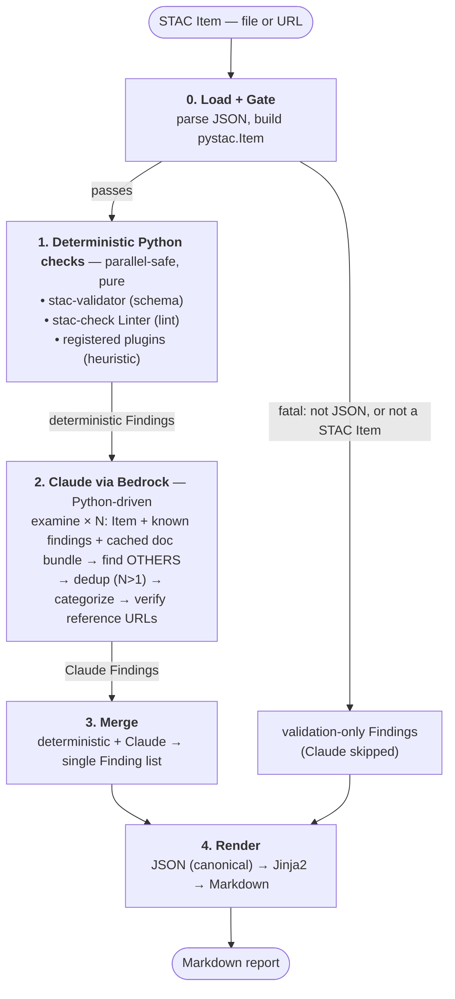

# STAC Validator Plus — Design Document

**Status:** Draft for implementation · **Date:** 2026-07-23 · **Author:** John Donovan (jdonovan@sparkgeo.com)

**Revised 2026-07-27:** LLM backend changed from headless `claude -p` to **AWS Bedrock** (see §8 and the ripples in §10–14, §16–17). Reason: operational problems running Claude headless. Everything upstream of the Claude stage (gate, deterministic checks, plugins, the `Finding` model) is unchanged.

## 1. Purpose

Combine deterministic Python STAC validation (from `../eodh-validator`) with LLM-based
semantic review (from `../claude-stac-validator`) into a single tool that produces one
categorized Markdown report for a STAC Item.

**Flow:** User provides a STAC Item → deterministic Python checks run → the Item *and*
those findings are passed to Claude to catch **other** (semantic) issues → all findings
merge into one categorized JSON result → rendered to Markdown.

The guiding principle is a clean division of labour: **let deterministic code do what it
does exactly (schema conformance, mechanical lint), and let Claude do what code cannot
(judgment, cross-field semantics, spec interpretation).**

## 2. Scope

### v1 (this document)
- **Unit of work:** a single STAC **Item**. An arbitrary Item is assumed representative
  of its collection.
- **Input:** a local file **or** a URL (via `fsspec`/`httpx`).
- **Interface:** CLI only.
- **Output:** Markdown report to stdout by default; `-o` to persist; `--json` for raw JSON.

### V2 (explicitly deferred)
- Accept a **Collection/Catalog** and validate recursively down the tree, as
  `eodh-validator` does today.
- A **FastAPI** wrapper — deferred until we understand real per-run time/cost, and because
  a proper API needs async job submission (`202` + status polling), since a run takes
  many seconds to a minute+.

## 3. Pipeline architecture



Python is the orchestrator of the whole pipeline; the Claude sub-orchestration
(fan-out/dedup/categorize) is also driven from Python (see §8), not delegated to a
Claude Code workflow/skill.

## 4. Core data model

One normalized `Finding` type is the contract that **every** source emits into — schema
validator, linter, each plugin, and Claude. Modelled with **Pydantic** (also used to
validate Claude's JSON output).

```python
class Category(StrEnum):
    VALIDATION   = "validation"      # JSON / structural / non-STAC-specific errors (the gate)
    CORE         = "core"            # core STAC spec compliance
    BEST_PRACTICE = "best-practice"  # recommendations
    EXTENSION    = "extension"       # extension-related

class Confidence(StrEnum):
    NORMATIVE = "normative"   # grounded in spec/schema text — authoritative
    HEURISTIC = "heuristic"   # seen-in-the-wild pattern — advisory

class Reference(BaseModel):
    title: str
    href: str
    version: str | None = None      # numeric versions prefixed "v"; else "latest"

class Finding(BaseModel):
    source: str                     # "stac-validator" | "stac-check" | "<plugin>" | "claude"
    category: Category
    confidence: Confidence
    message: str                    # human-worded; field/property names in back-ticks
    json_path: str | None = None    # e.g. "properties.sar:instrument_mode"
    references: list[Reference] = []

class UsageSummary(BaseModel):
    tokens: int
    cost: float
    model: str

class ValidationReport(BaseModel):
    item_id: str
    source_uri: str
    generated_on: str
    gated: bool                     # True if we stopped at the gate (Claude skipped)
    findings: list[Finding]
    usage: UsageSummary | None      # tokens/cost accumulated across Claude calls
```

- **Category** is the primary axis (Claude produces steadier output grouping by
  category than by a judged severity). No separate severity scale.
- **source + confidence** together let a heuristic plugin finding sit beside a hard schema
  failure without pretending to equal authority.

## 5. Stage 0 — Load & validation gate

`backend/loader.py` + `backend/gate.py`.

- **Load:** resolve local path or URL with `fsspec` (local, S3, http) / `httpx`; read bytes;
  parse JSON; build a `pystac.Item`.
- **Soft gate — stop before Claude only when:**
  1. input is not parseable JSON, **or**
  2. it's valid JSON but not identifiably a STAC Item (`type != "Feature"`, or
     `stac_version` missing).
- A schema-**invalid-but-parseable** Item does **not** stop — it still proceeds to Claude
  (Claude can often explain *why* it's wrong better than a raw schema error).
- On a gate stop: emit a `validation`-category report and exit early (saves credits).

## 6. Stage 1 — Deterministic Python checks

All checkers are pure and parallel-safe; each returns `list[Finding]`.

| Checker | Library | Emits | Confidence |
|---|---|---|---|
| Schema | `stac-validator` | `core` (+ `validation`) | `normative` |
| Lint | `stac-check` `Linter` | `best-practice`, some `core` | `normative` |
| Extension heuristics | in-tree plugin (§7) | `extension` | `heuristic` (may be `normative`) |

- `stac-validator` is the **authoritative** conformance verdict — the one thing the LLM is
  never trusted to do.
- `stac-check` config carries over from `eodh-validator/stac-check.config.yaml`
  (e.g. `geometry_coordinates_order: false`, `max_links`, `max_properties`).
- `extensions.json` is **shipped pre-built** as package data (`data/extensions.json`).
  Its *generation* (`get_extensions.py`, which scrapes the `stac-extensions` GitHub org)
  is a separate offline concern refreshed periodically — **never** run at validation time.

## 7. Plugin architecture

For pragmatic, seen-in-the-wild checks with tailored messages, kept out of the core.

- **Discovery: explicit in-tree registry** (decorator). Chosen deliberately — the tool is
  run by us on providers' catalogs, so when a new violation pattern emerges we add an
  in-tree plugin in minutes, with no packaging, entry-point, or third-party wait.
- **Interface — pure and idempotent:**
  ```python
  @register
  class ExtensionHeuristics:
      name = "extension-heuristics"      # → Finding.source
      def check(self, item: Item, context: PluginContext) -> list[Finding]: ...
  ```
- **`PluginContext`** carries shared, pre-loaded resources so plugins don't re-fetch:
  the raw item `dict`, the parsed `pystac.Item`, and the loaded `extensions.json` metadata.
- Plugins default to `confidence="heuristic"`; may emit `normative` when a check is
  genuinely spec-grounded.
- **First plugin:** the extension checks ported from `eodh-validator/main.py`
  (`test_item_extensions`) — maturity warnings, Item-vs-Collection scope, declared-but-unused
  extensions, used-but-undeclared prefixes, unknown prefixes, nested-property advice.
  The core **dogfoods** the public plugin interface via this plugin.
- Plugins are **toggleable by name** in config (disable noisy ones per catalog).
- Plugin findings feed both the report and the "already known" set injected into Claude.

## 8. Stage 2 — Claude via AWS Bedrock (Python-orchestrated)

> **Backend change (2026-07-27).** The LLM stage now calls **AWS Bedrock** instead of a
> headless `claude -p` subprocess. This removes the "authenticated `claude` CLI on the
> host" ops constraint, but also removes the agentic **WebFetch** loop the headless CLI
> gave us — a plain Bedrock Messages call has no web access. Doc grounding is therefore
> re-designed (see *Doc grounding* below). Python still owns the whole pipeline and the
> LLM sub-orchestration (examine → dedup → categorize).

### Invocation
- **Bedrock via the `anthropic[bedrock]` SDK** (`AnthropicBedrock` client) — keeps the
  Messages API shape, so the prompt/orchestration logic is provider-shaped, not `boto3`
  plumbing. Region is required.
- **Auth:** standard AWS credential chain (IAM role / env / SSO **profile**) + **Bedrock
  model access enabled** in the account/region. This replaces the headless-CLI login
  constraint (better fit for the eventual FastAPI service).
- **Model IDs carry the `anthropic.` prefix** on Bedrock — e.g.
  `anthropic.claude-sonnet-5` (default), `anthropic.claude-opus-4-8` (optional). Passed
  explicitly on every call for reproducibility.
- **Structured output via forced/strict tool-use.** Define a single output tool whose
  schema is the `Finding` list and force it with `tool_choice`; the tool call returns
  schema-valid JSON directly. Pydantic re-validates as a backstop, with a small capped
  retry on mismatch. This **replaces the fragile headless "prompt-for-JSON → strip fences →
  balanced-brace extraction"** dance entirely — most of the old issue #9 risk disappears.

### Doc grounding (cached bundle + citations + URL verification)
Replaces the lost WebFetch loop. Claude is *given* the relevant docs rather than fetching
them:

- **Targeted bundle.** For each Item, assemble: the core STAC spec + best-practices docs,
  plus the README for every extension that is **declared *or* used**. Used-but-undeclared
  extensions are found by scanning property namespaces (`sar:`, `proj:`, …) and mapping the
  prefixes via `extensions.json` — **the same prefix-extraction logic the extension
  plugin (§7) already implements**, shared, not duplicated. This deliberately catches the
  common "extension used without being declared" case; Claude's strong prior on the core
  spec covers anything the mapping misses.
- **Delivered as a cached prefix.** The bundle is sent as inline content blocks with an
  explicit `cache_control` breakpoint. Bedrock has **no Files API and no archive upload**,
  so docs are inlined each request; but Bedrock **prompt caching** means the stable bundle
  is written once (~1.25×/2×) and read at **~0.1×** across the `examine_runs` passes (and,
  in V2, across many items within the cache TTL). *Automatic* caching is unavailable on
  Bedrock — breakpoints are placed **manually** (max 4).
- **Citations.** Bedrock supports document citations; grounded citations map straight into
  the `Reference` model.
- **Deterministic URL verification (backstop).** Every reference URL Claude emits is checked
  in Python (HEAD/GET against the STAC-domain allowlist); unresolved / hallucinated links
  are dropped or flagged. This absorbs the old `VALIDATE_PROMPT` "ensure links exist"
  instruction into deterministic code.
- **Docs are pre-downloaded package data** (`data/docs/`), refreshed offline like
  `extensions.json` — **never** fetched at validation time.

### Orchestration (`backend/claude/orchestrator.py`)
1. **Examine × N** (`examine_runs`, default low, configurable — the main cost lever).
   Each run is given the Item, the deterministic findings, and the **cached doc bundle**,
   told *"these issues are already known; find **other** issues."* Bounded by `max_concurrent`.
   - **Compact injection:** the known findings are injected in a **stripped-down form —
     `message` + `json_path` only, not full `references`** — because they repeat on *every*
     parallel examine pass and full reference lists would multiply token cost with no
     analytical benefit. The full findings are still preserved for the report. (The doc
     bundle, by contrast, is identical across passes and rides the prompt cache.)
2. **Dedup** — only when `N > 1`; merge semantically equivalent issues, keep best wording,
   union references.
3. **Categorize** — group Claude's net-new findings into `core` / `best-practice` /
   `extension`.
4. **Verify reference URLs** — deterministic link check (above); prune dead links.

Prompt text and schemas are **lifted from `claude-stac-validator/stac-review.js`**
(`EXAMINE_PROMPT`, `DEDUP_PROMPT`, `VALIDATE_PROMPT`) into `backend/claude/prompts.py`,
adapted to (a) receive known findings, (b) emit the `Finding` shape via the forced output
tool, and (c) point the "answer only from the docs" instruction at the **supplied bundle**
rather than at repos to fetch.

### Model
- **Default: `anthropic.claude-sonnet-5`.** **Opus (`anthropic.claude-opus-4-8`) optional**
  via config/flag. Rationale unchanged: moving most mechanical work into Python may leave
  Sonnet sufficient for semantics; revisit if not.

## 9. Stages 3–4 — Merge & render

- **Merge:** concatenate deterministic + Claude findings into one list (no re-reconciliation
  needed — Claude was told to produce only *net-new* issues).
- **JSON is canonical.** The Markdown report is a pure renderer over the `ValidationReport`.
- **Template:** evolve `claude-stac-validator/report.md.jinja2` to the 4-category layout
  (validation / core / best-practice / extension), with a summary count table and,
  per finding, its `source`, `confidence`, and reference links.

## 10. CLI surface

`curl`-style: stdout by default, `-o` to persist.

```
stac-validator-plus <ITEM>            # file path or URL
  -o, --output PATH                   # write report to file/dir (auto-name in a dir); default stdout
      --json                          # also emit the raw canonical JSON
      --config PATH                   # config file (default: ./stac-validator-plus.toml)
      --model {sonnet|opus|<id>}      # maps to a Bedrock model ID (anthropic.claude-*)
      --region NAME                   # AWS region for Bedrock (else AWS_REGION / config)
      --examine-runs N                # fan-out count
      --timeout SECONDS               # per Bedrock request
      --max-concurrent N              # concurrent Bedrock requests
      --no-plugin NAME / --no-check NAME
      --wall-clock-budget SECONDS     # abort run (best-effort)
      --token-budget N                # abort between calls when exceeded
```

(`--max-turns` is gone — there is no agentic loop in a plain Bedrock Messages call.)

Built with `rich-click` (existing `cli` extra).

## 11. Configuration

- **File:** `stac-validator-plus.toml` (CWD or `--config`), parsed with stdlib `tomllib`
  (no YAML dep). CLI flags override file values per run.
- **Settings model** (Pydantic): `model` (Bedrock ID), `region`, `aws_profile`,
  `examine_runs`, `request_timeout`, `max_concurrent`, `cache_ttl` (`5m`/`1h`),
  `bundle_docs` (on/off), `wall_clock_budget`, `token_budget`, `enabled_plugins`,
  `enabled_checkers`, `reference_url_allowlist` (STAC domains for link verification).

## 12. Credit / time guardrails

- `examine_runs` — primary cost lever (dial to 1 for cheap, up for thorough).
- **Prompt caching** — the doc bundle is a cached prefix, so re-injecting it across the
  `examine_runs` passes (and, in V2, across items) reads at ~0.1× instead of full price.
  The single biggest structural cost saver now that docs are inlined.
- Per-request **timeout** — kill hung calls.
- `max_concurrent` — cap simultaneous Bedrock requests.
- **Wall-clock budget** — overall timer; abort remaining stages.
- **Token/cost budget** — now **precise between calls**: each Bedrock response reports exact
  input/output/cache token counts, so the orchestrator accumulates real usage and aborts
  before the next call once the budget is hit. (Still not a mid-call hard cap — `max_tokens`
  bounds a single response.) **Cost** is *derived* by us (token counts × configured
  per-token Bedrock rates); the API does not return a dollar figure — actual spend is AWS
  billing, out of band.
- Fallback per author: manually tune prompts / `examine_runs` to balance cost vs detail.

## 13. Proposed module layout

```
src/stac_validator_plus/
  __init__.py  __main__.py
  cli.py                     # rich-click entrypoint
  config.py                  # tomllib load + flag override → Settings
  models.py                  # Finding, Reference, ValidationReport, enums (Pydantic)
  pipeline.py                # orchestrates gate → checks → claude → merge → render
  backend/
    loader.py                # fsspec/httpx load + JSON parse + pystac.Item
    gate.py                  # Stage 0 soft gate
    checks/
      schema.py              # stac-validator wrapper → Findings
      lint.py                # stac-check Linter wrapper → Findings
    plugins/
      __init__.py            # @register registry, PluginContext, discovery
      extensions.py          # ported extension heuristics (first plugin)
    claude/
      runner.py              # AnthropicBedrock client: messages + forced-tool output + usage + retry
      orchestrator.py        # examine fan-out → dedup → categorize → verify URLs
      docs.py                # select (declared+used) + load cached doc bundle; shares prefix logic w/ §7
      prompts.py             # prompt templates lifted from stac-review.js
  report/
    render.py                # Jinja2
    templates/report.md.jinja2
  data/
    extensions.json          # pre-built package data
    docs/                    # pre-downloaded STAC spec + extension READMEs (offline-refreshed)
```

## 14. Dependencies

Add to `pyproject.toml`: `stac-validator`, `stac-check`, `pystac`, `pydantic`, and
**`anthropic[bedrock]`** (pulls `boto3` transitively for the AWS credential chain).
Already present: `pystac-client`, `jinja2`, `httpx`, `fsspec`, `loguru`; `rich-click`
(cli extra). Dev: `pytest`, `ruff` (present).

## 15. Testing

- **Pure units:** gate, each checker, each plugin — deterministic, no network, no Claude.
- **Claude stage:** mock the `runner.py` subprocess boundary; assert orchestration
  (fan-out count, dedup, categorize) and Pydantic-validation/retry behaviour on
  malformed model output.
- **Fixtures:** reuse example Items from `claude-stac-validator/examples/`.
- **Render:** golden-file test of Markdown against a known `ValidationReport`.

## 16. Security notes

- **Do not commit secrets.** `eodh-validator/main.py` currently contains a hardcoded bearer
  token and DroneDB admin credentials — these must be scrubbed and rotated (tracked
  separately; not carried into this project). This tool takes auth for remote fetches via
  env/config only.
- **Bedrock auth via the AWS credential chain** (IAM role / SSO profile / env) — no API key
  or long-lived secret committed. **Ops constraint:** the host needs AWS credentials and
  **Bedrock model access enabled** for the chosen models in the region. Least-privilege
  IAM: only `bedrock:InvokeModel` (± the streaming variant) on the specific model ARNs.
- Reference-URL verification is restricted to the STAC-domain allowlist; bundled docs are
  shipped offline (no fetch at validation time).
- Plugins execute in-process — keep them in-tree and reviewed (a reason the registry is
  explicit, not a directory scan of arbitrary files).

## 17. Open questions / future

- V2 recursion strategy (sampling one Item per collection vs all).
- V2 async FastAPI job model once per-run time/cost is measured.
- Whether Sonnet's semantic recall is sufficient or Opus should become the default.
- Periodic refresh cadence and CI for the shipped `extensions.json` **and `data/docs/`**.
- Doc-bundle scope: targeted (declared+used) for v1 single-Item; revisit widening to the
  **full corpus** for V2 batch runs, where prompt caching amortises the big prefix.
- Prompt-cache TTL tuning: `5m` is enough for one Item's `examine_runs`; `1h` likely pays
  off for V2 batch sweeps.
- Whether the model's training-knowledge grounding + citations makes the targeted bundle
  worth its token cost, or a lighter "cite-from-knowledge + verify URLs" mode suffices.
```
